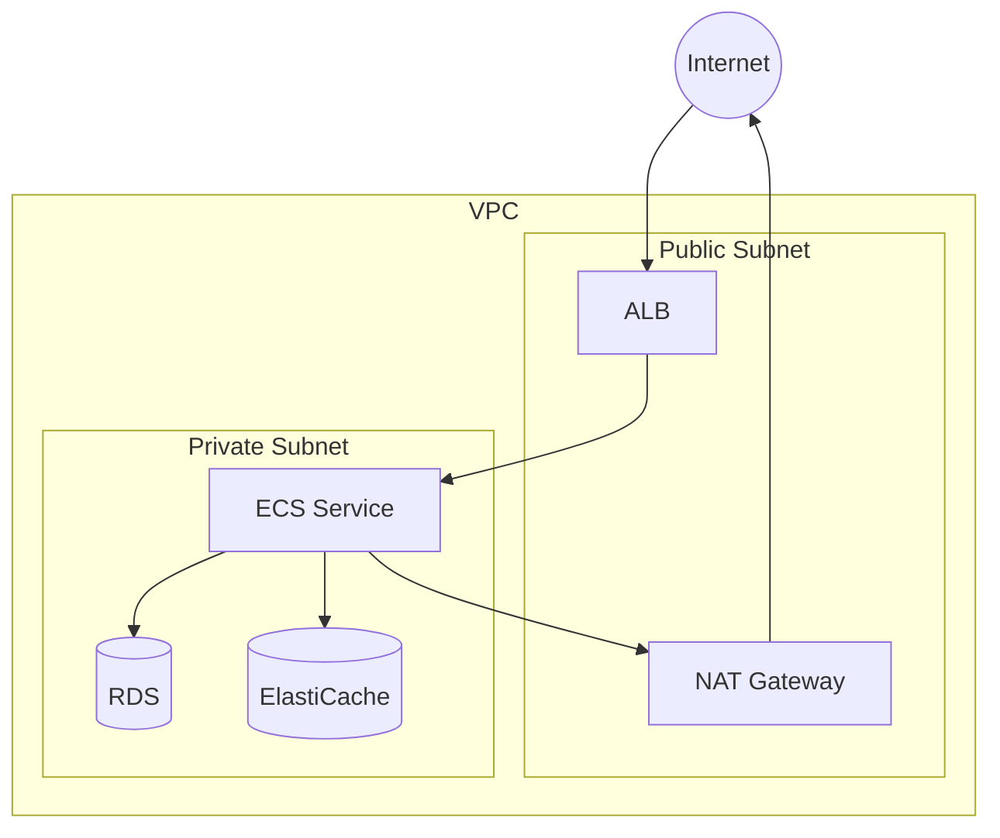

# AWS Architecture Diagram Generator

AWS リソース情報からアーキテクチャ図を生成するスキルです。

## 入力

以下の AWS CLI 出力を1つ以上:
- `aws ecs describe-services`
- `aws ec2 describe-subnets`
- `aws elbv2 describe-load-balancers`
- `aws rds describe-db-instances`
- `aws elasticache describe-replication-groups`
- `aws ec2 describe-vpcs`
- または Terraform コード

引数がない場合は「AWS CLI の出力または Terraform コードを貼り付けてください」と聞く。

## 解析内容

以下のリソース間の関係を識別する:

- Internet → ALB (パブリックサブネット)
- ALB → ECS / EC2 (ターゲットグループ経由)
- ECS / EC2 → RDS (プライベートサブネット)
- ECS / EC2 → ElastiCache / Redis
- ECS / EC2 → S3 (データストア)
- ECS / EC2 → NAT Gateway → Internet (アウトバウンド)
- VPC / サブネット境界
- セキュリティグループの許可関係

## 出力フォーマット

Mermaid 形式のダイアグラムを出力する:

````
## AWS Architecture Diagram



### コンポーネント説明
- **ALB**: (名前・リスナーポート)
- **ECS**: (サービス名・タスク数)
- **RDS**: (エンジン・インスタンスタイプ)
- **ElastiCache**: (エンジン・ノード数)
````

## 注意

- 情報が不足しているコンポーネントは推定して図を作成し、末尾に「推定箇所」を明記する
- VPC/サブネット情報がある場合は subgraph でグルーピングする
- 出力は日本語
